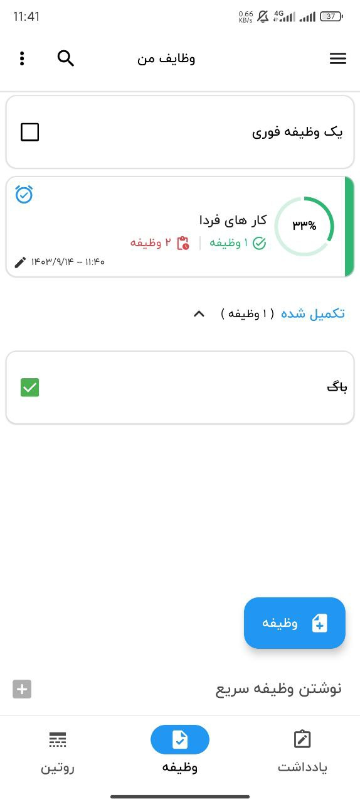

## 📜 Description  
Hi! Task Manager is a modern app designed for managing your tasks and routines efficiently. Built with Jetpack Compose, Material 3, the app follows the MVVM Architecture Pattern to ensure high performance, scalability, and maintainability. With Coroutines, Flow, DataStore, Dagger-Hilt, Room Database, and Navigation, it provides a seamless experience.

**You can download the app from Cafe Bazaar🚀** 

## Features
- Single Activity architecture  
- MVVM architecture  
- Task management with the ability to create and track tasks  
- Alarm setting for reminders on tasks  
- Routine management for scheduling weekly and regular routines  
- Dark mode support  

## 🛠 Built With

| Architecture              | MVVM Architecture Pattern       |
|---------------------------|---------------------------------|
| 🖼️ UI Framework            | [Jetpack Compose](https://developer.android.com/jetpack/compose) |
| 🛠️ DI                      | [Dagger-Hilt](https://dagger.dev/hilt/) |
| 🗄️ Local Database          | [Room Database](https://developer.android.com/jetpack/androidx/releases/room) |
| 🌐 Navigation              | [Compose Destinations Navigation](https://developer.android.com/develop/ui/compose/navigation) |
| 🔧 Asynchronous Work        | [Coroutines](https://kotlinlang.org/docs/coroutines-overview.html) |
| 🌊 Reactive Programming      | [Flow](https://kotlinlang.org/docs/flow.html) |
| 📊 Data Storage            | [DataStore](https://developer.android.com/topic/libraries/architecture/datastore) |
| ⏰ Alarm Management         | [AlarmManager](https://developer.android.com/reference/android/app/AlarmManager) |
| 🖼️ Image Loading            | [Glide](https://github.com/bumptech/glide) |

## :iphone: Screenshots
<table style="width:100%">
  <tr>
    <th>Note Screen</th>
    <th>Routine Screen</th> 
    <th>Task Screen</th> 
  </tr>
  <tr>
    <td></td> 
    <td></td>
    <td></td>
  </tr>
  <tr>
    <th>Add Note Screen</th>
    <th>Add Routine Screen</th> 
    <th>Add Task Screen</th> 
  </tr>
  <tr>
    <td></td> 
    <td></td>
    <td></td>
  </tr>
</table>

### :iphone: Dark Mode Screenshots
<table style="width:100%">
  <tr>
    <th>Note Screen (Dark)</th>
    <th>Routine Screen (Dark)</th> 
    <th>Task Screen (Dark)</th> 
  </tr>
  <tr>
    <td></td> 
    <td></td>
    <td></td>
  </tr>
  <tr>
    <th>Add Note Screen (Dark)</th>
    <th>Add Routine Screen (Dark)</th> 
    <th>Add Task Screen (Dark)</th> 
  </tr>
  <tr>
    <td></td> 
    <td></td>
    <td></td>
  </tr>
</table>

